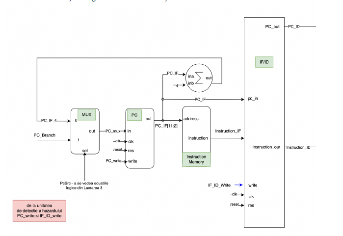
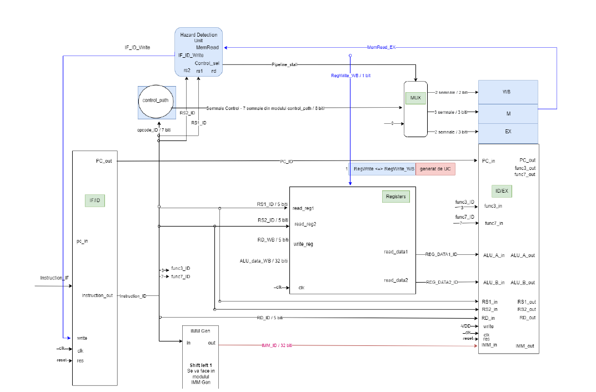
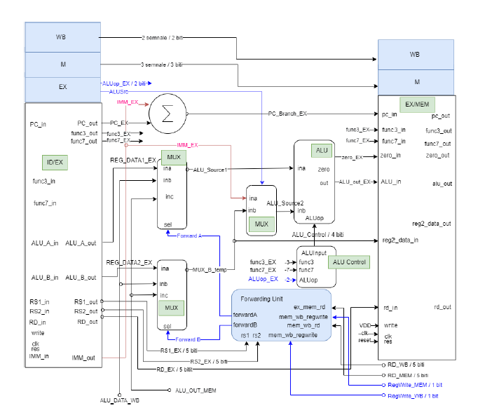
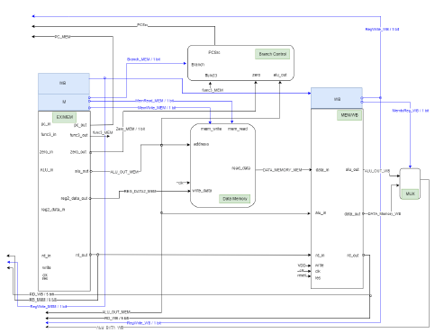

# [Tiny-RISC-V](./pdfs/draw_riscv.pdf)

## Description

The `Tiny RISC-V processor` is a **minimalist implementation** based on the [RISC-V Instruction Set Architecture (ISA)](./pdfs/tinyrv-isa.txt). The processor is implemented more from a logical perspective of how it works.

The implementation of the RV32I extension. This **32-bit processor** is capable of executing integer arithmetic and logical instructions without support for **floating-point operations or multiplication/division**.

## Key Features

- `RV32I Extension`: Supports the RV32I instruction set, focusing on integer arithmetic and logical operations.
- **Five-stage pipeline architecture** for instruction execution: `Fetch`, `Decode`, `Execute`, `Memory`, and `Write-back`.
- **Hazard detection** mechanisms to handle **data hazards** and **control hazards**.
- **Forwarding techniques** to solve data hazards by forwarding data from the `Execute` stage to *dependent stages*.
- **Control path** for managing instruction *flow* and handling *control* hazards.
- **Error detection** mechanisms at *each stage of the pipeline* to ensure reliable operation.
- **ISA Table** provides additional details about each instruction format in the RISC-V architecture. It outlines their specific functionalities and use cases:

| Format       | Description                                         | Example                        |
|:------------:|:----------------------------------------------------|:-------------------------------|
| **R-Type**   | Arithmetic and logical operations between registers | `add rd, rs1, rs2`             |
| **I-Type**   | Instructions involving immediate values             | `addi rd, rs1, imm`            |
| **S-Type**   | Store instructions                                  | `sw rs2, offset(rs1)`          |
| **B-Type**   | Branch instructions                                 | `beq rs1, rs2, label`          |
| **U-Type**   | Instructions with a 20-bit immediate value          | `lui rd, imm`                  |
| **J-Type**   | Jump instructions                                   | `jal rd, label`                |

> **NOTE:**
> **S-Type** [transferring data from register to memory]
> **B-Type** [evaluating conditions to update the program counter]
> **U-Type** [often used for PC-relative addressing]
> **J-Type** [directly modifying the program counter]

## Processor Pipeline

**Each stage** in the RISC-V processor pipeline plays a **crucial role** in instruction execution, contributing to higher performance through parallelism and pipelining while reducing instruction latency.

Here's a brief overview of the pipeline stages:

- Each pipeline stage has its ***own set*** of control signals and data paths.
- Pipeline registers are used to **store data** and **control signals** between stages.
- Control signals determine the **flow of data** and **execution of operations** in each stage.
- Hazards, such as **data hazards** and **control hazards**, are detected and resolved using **forwarding logic** and **branch prediction techniques**.

These stages work together to facilitate efficient instruction execution within the RISC-V processor pipeline, demonstrating the effectiveness of parallelism and pipelining.

## [Instruction Fetch (IF)](./images/IF.png)

  

  <b>IF (Instruction Fetch):</b> initiates instruction fetching by accessing memory and retrieving the current instruction based on the program counter (PC). It ensures smooth instruction flow and handles branching/jumping.

### Signals IF

- **PC:** Holds the address of the next instruction to fetch, updated based on control signals and branch outcomes.
- **Instruction Memory:** Provides the instruction at the PC address, transferred to subsequent pipeline stages.
- **PC Write:** Determines PC update, controlled by branch/jump instructions, indicating whether the PC should be modified to redirect the instruction flow.
- **IF/ID Pipeline Register:** Serves as a buffer, transferring fetched instruction to the ID stage.

### Operations IF

- Increment PC: Advances to the next instruction  in memory, ensuring sequential instruction fetching.
- Fetch Instruction: Accesses memory to retrieve the instruction using the current value of the PC, retrieving the instruction stored at that address.
- Control Signal Determination: Identifies branching/jumping instructions for deferred execution. However, branching or jumping instructions is deferred until the ID stage; decision is made whether to update the PC.

## [Instruction Decode (ID)](./images/ID.png)

  

  <b>ID (Instruction Decode):</b> decodes the fetched instruction, determines its operation and operands, and reads register values from the register file. Additionally, it sets up data paths for subsequent stages and identifies register sources and destinations for efficient data handling.

### Signals ID

- Instruction, contains the decoded instruction, providing operation information.
- Registers provide values for instruction operands, ensuring data availability.
- Control Signals specifies operations (e.g., ALU selection, register write), ensuring correct execution.
- Immediate Generation for specific instructions, aiding arithmetic or logical operations.
- Forwarding Signals indicates data forwarding necessity for hazard resolution, preventing stalls.
- Branch Control Signals determines branch conditions, managing instruction flow.
- ID/EX Pipeline Register transfers decoded instruction and control signals to the EX stage.

### Operations ID

- Decode the instruction and extract relevant fields, such as the opcode, source/destination registers, and immediate value, preparing it for execution.
- Read register values from the register file, ensuring that data is available for instruction execution.
- Generate control signals based on the instruction type, orchestrating pipeline operations.
- Prepare data forwarding and branch control signals, facilitating efficient execution and hazard handling.

## [Execute (EX)](./images/EX.png)

  

  <b>EX (Execute):</b> performs the actual execution of instructions, including arithmetic and logical operations using the ALU, calculation of branch targets, and management of data forwarding to resolve hazards. It also makes decisions on branching based on control instructions.

### Signals EX

- **ALU Inputs:** Receive operands from the ID stage or forwarded values, providing data for ALU operations.
- **Control Signals:** Specify the ALU operation and other execution details, ensuring correct operation execution.
- **Branch Target Address:** Calculated for branch instructions, determining the target address for branching.
- **EX/MEM Pipeline Register:** Transfers operation results and data to the MEM stage, facilitating data flow.

### Opeartions EX

- Perform arithmetic, logic, or shift operation using the ALU, providing computation for instruction execution.
- Calculate branch target addresses, it decides to take a branch based on control instructions, managing instruction flow. Determines branch targets, controls branching.
- Forward data if necessary to resolve hazards, ensuring smooth execution without stalls.
- Prepare data for the next stage based on the operation type, facilitating efficient execution and data flow.

## [Memory (MEM) | Write Back (WB)](./images/MEM_WB.png)

  

  <b>MEM (Memory):</b> handles memory access operations for load and store instructions, ensuring seamless interaction with the data memory. It reads data from memory for load operations, writes data to memory for store operations, and manages memory-related hazards such as cache misses or contention.

  <b>WB (Write Back):</b> completes the instruction execution cycle by writing the final results back to the register file. It updates register values based on the instruction's execution, ensuring subsequent instructions have access to the updated data.

### Signals MEM

- **Data Memory:** Reads/writes data from/to memory, facilitating interaction with the data memory.
- **Data Address:** Specifies the memory address for data access, determining the location of data in memory.
- **Write Data:** Data to be written for store instructions, ensuring proper storage.
- **MEM/WB Pipeline Register:** Transfers data or operation results to the WB stage for further processing.

### Opearations MEM

- Accesses data memory for load/store instructions, ensuring proper data interaction.
- Reads data from memory for load instructions, retrieving  data.
- Writes data to memory for store instructions, managing storage.
- Manages memory-related hazards like cache misses or contention, ensuring synchronization and operation.

### Signals WB

- **Register Write Data:** Result of the operation to be written back to the register file, update old values.
- **Write Register:** Specifies destination register for write operation.
- **RegWrite:** Control signal enabling register writing, managing register file updates.

### Opearations WB

- Writes back operation result to specified register, updating values for subsequent instructions.
- Controls register write operation, ensuring proper management within pipeline.
